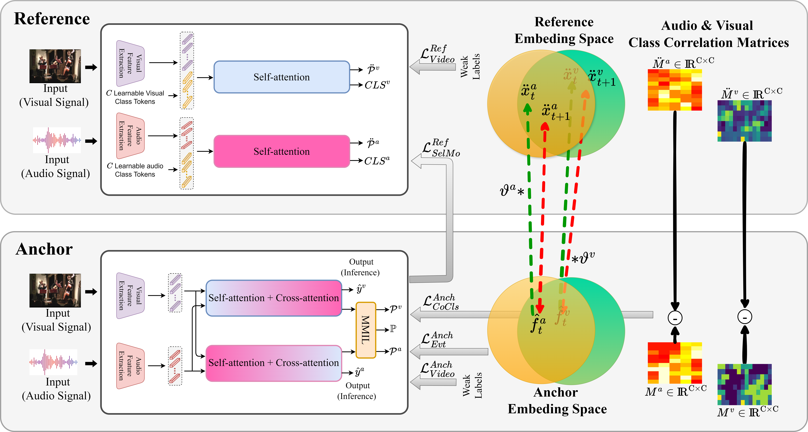

## CoLeaF: A Contrastive-Collaborative Learning Framework for Weakly Supervised Audio-Visual Video Parsing

[Faegheh Sardari](https://scholar.google.com/citations?user=_8dV3CgAAAAJ&hl=en&oi=ao), [Armin Mustafa](https://scholar.google.com/citations?user=0xOHqkMAAAAJ&hl=en), [Philip J.B. Jacksonn](https://scholar.google.com/citations?user=vgue80YAAAAJ&hl=en), [Adrian Hilton](https://scholar.google.com/citations?user=vTIYTNQAAAAJ&hl=en)

Code for ECCV 2024 paper [CoLeaF: A Contrastive-Collaborative Learning Framework for Weakly Supervised Audio-Visual Video Parsing](https://arxiv.org/abs/2405.10690)

<br><br><br>


## Prerequisites
- Linux 
- Python 3
- CPU or NVIDIA GPU + CUDA CuDNN

## Data Preparation
1. Create a folder named 'features' inside the data folder
2. Download the audio and visual features from https://github.com/YapengTian/AVVP-ECCV20 and transfer them to the 'features' folder.

## Train & Test
Run main.py 

## Test our pretrianed model
Run main.py --mode test
   
[Project](https://github.com/faeghehsardari/coleaf) |  [Paper](https://arxiv.org/pdf/2405.10690)

## Citation
If you use this code for your research, please cite our papers.
```
@article{sardari2024coleaf,
  title={CoLeaF: A Contrastive-Collaborative Learning Framework for Weakly Supervised Audio-Visual Video Parsing},
  author={Sardari, Faegheh and Mustafa, Armin and Jackson, Philip JB and Hilton, Adrian},
  journal={European Conference on Computer Vision},
  year={2024}
} 
```
## Acknowledgments
This repository includes the modified codes from:
- HAN (ECCV-2020) https://github.com/YapengTian/AVVP-ECCV20 
- JoMoLD (ECCV-2022) https://github.com/MCG-NJU/JoMoLD
- CMPAE (CVPR-2023) https://github.com/MengyuanChen21/CVPR2023-CMPAE?tab=readme-ov-file shared under this license (https://github.com/MengyuanChen21/CVPR2023-CMPAE/blob/main/LICENSE)
  
We are grateful to the creators of these repositories.

This research is also supported by UKRI EPSRC Platform Grant EP/P022529/1, and EPSRC BBC Prosperity Partnership AI4ME: Future Personalised ObjectBased Media Experiences Delivered at Scale Anywhere EP/V038087/1.
